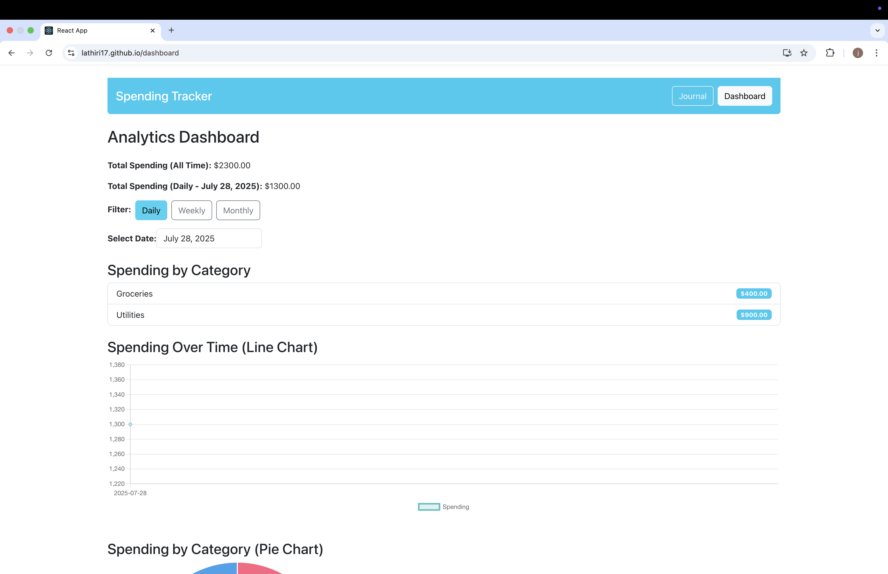
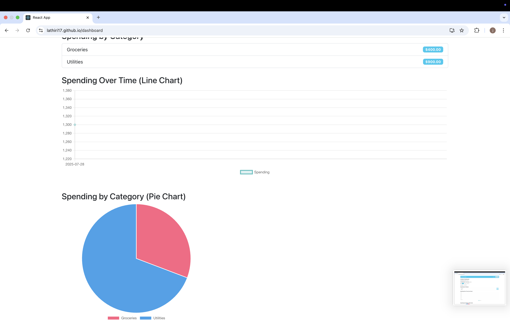
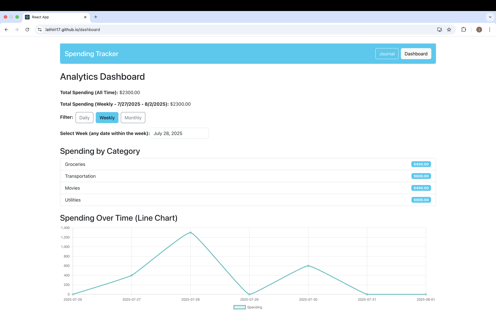
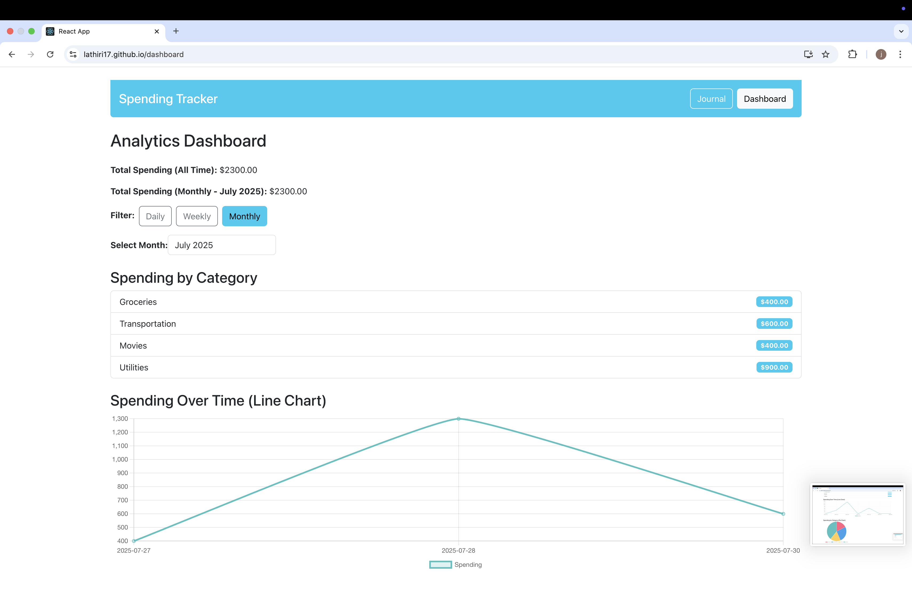
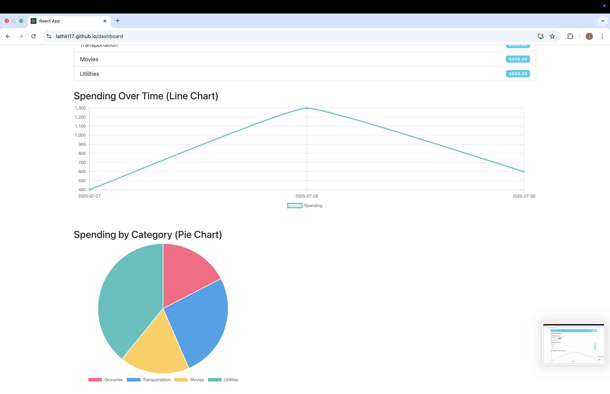
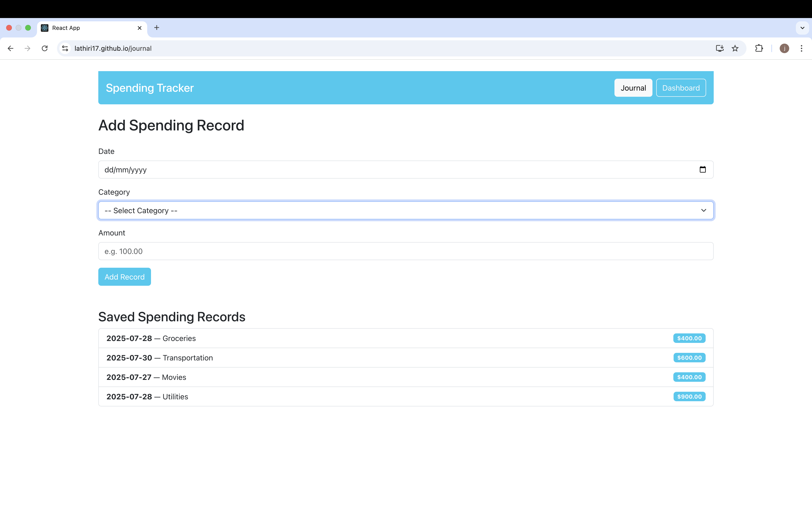
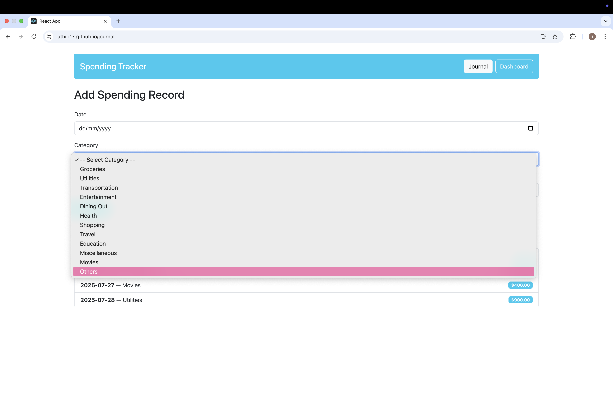
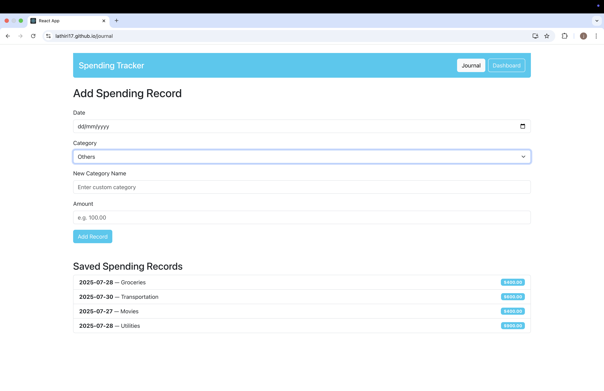

# Spending Tracker App

This is a React.js spending tracker app with analytics dashboard and journal pages.

## Team Members
- Lamin Thiri
- Sai Kyaw Zin Ye Tun
- Khaing Zaw Lin

## Screenshots

### Analytics Dashboard

### Journal Page

## GitHub Pages  
[https://LaThiri17.github.io/spending-tracker/](https://LaThiri17.github.io/spending-tracker/)

---

## How to run locally

1. Clone the repository:  
   `git clone https://github.com/LaThiri17/spending-tracker.git`
2. Navigate into the project folder:  
   `cd spending-tracker`
3. Install dependencies:  
   `npm install`
4. Start the development server:  
   `npm start`
